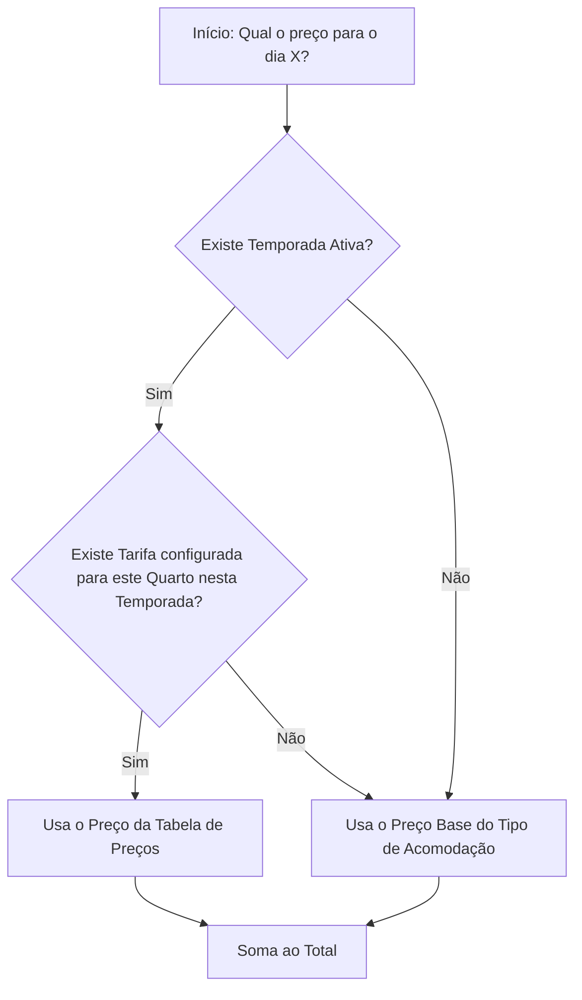

# Estrutura de Precificação do CRM

Este documento explica como o sistema decide qual preço cobrar por uma diária, considerando a hierarquia de três níveis implementada.

## 1. Os Três Pilares do Preço

O sistema utiliza uma estrutura de "estratégias sobrepostas" para garantir que sempre haja um preço disponível e permitir variações sazonais complexas.

### A. Preço Base (Tipo de Acomodação)
*   **O que é:** O valor padrão definido no cadastro do Tipo de Acomodação.
*   **Função:** Servir como uma rede de segurança (fallback). Se não houver nenhuma temporada ativa ou tarifa configurada para uma data, o sistema usará este valor.
*   **Onde fica:** `Administração > Tipos de Acomodação > Editar`.

### B. Temporadas
*   **O que é:** Definição de períodos cronológicos (Ex: Dezembro/Janeiro, Carnaval, Baixa Temporada).
*   **Função:** Agrupar datas e definir prioridade.
*   **Prioridade:** Se uma data cair em duas temporadas ao mesmo tempo, a de **maior valor numérico** na prioridade vence.
*   **Onde fica:** `Administração > Temporadas`.

### C. Tabela de Preços (Tarifas)
*   **O que é:** O cruzamento entre o *Tipo de Acomodação* e a *Temporada*.
*   **Função:** É aqui que o valor final de venda é definido para períodos especiais.
*   **Onde fica:** `Administração > Tabela de Preços`.

---

## 2. Fluxo de Decisão (Algoritmo)

Quando uma reserva é solicitada, para **cada dia** do período, o sistema segue este fluxo:

---

## 3. Exemplo Prático

**Configuração:**
*   **Suite Master:** Preço Base R$ 500,00.
*   **Temporada "Verão":** 01/Dez a 31/Jan (Prioridade 1).
*   **Temporada "Réveillon":** 28/Dez a 02/Jan (Prioridade 10).

**Tabela de Preços:**
*   Suite Master no "Verão": R$ 700,00.
*   Suite Master no "Réveillon": R$ 1.200,00.

**Resultado da Reserva (Diárias):**
*   **Dia 20 de Dezembro:** O sistema encontra apenas a temporada "Verão". Preço: **R$ 700,00**.
*   **Dia 31 de Dezembro:** O sistema encontra "Verão" e "Réveillon". "Réveillon" tem prioridade maior (10 > 1). Preço: **R$ 1.200,00**.
*   **Dia 15 de Junho:** Não há temporada ativa. Preço: **R$ 500,00** (Preço Base).

---

## 4. Benefícios desta Estrutura
1.  **Flexibilidade:** Você pode criar uma única temporada "Férias de Julho" e definir preços diferentes para todos os seus imóveis de uma só vez.
2.  **Segurança:** O sistema nunca exibirá erro de "preço não encontrado" (a menos que o preço base esteja zerado).
3.  **Inteligência:** Permite sobrepor promoções ou períodos especiais usando o sistema de prioridades.
